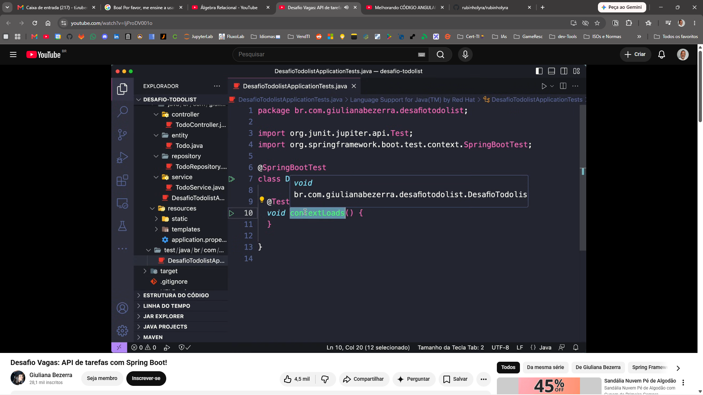

# QR Code Generator



**Produzido por [Rubinho Lyra](https://github.com/rubenslyra)**  
YouTube / TikTok / Instagram: **@rubinholyra**

---

Crie QR Codes estilizados com interface gráfica moderna em Python/Tkinter.

### Funcionalidades

- Geração de QR Codes a partir de texto ou URL
- 6 estilos de módulos: Quadrado, Círculo, Arredondado, Barras, etc.
- Cores personalizáveis (QR Code e fundo)
- Gradientes experimental (Radial, Horizontal, Vertical, Quadrado)
- Preview ao vivo
- Exportação para PNG, JPEG e BMP

### Como usar

```bash
pip install -r requirements.txt
python qrcode_gen.py
```

### Build

```bash
build.bat
```

Gera um executável único em `dist/QRCodeGenerator.exe` com metadados e manifesto Windows.
